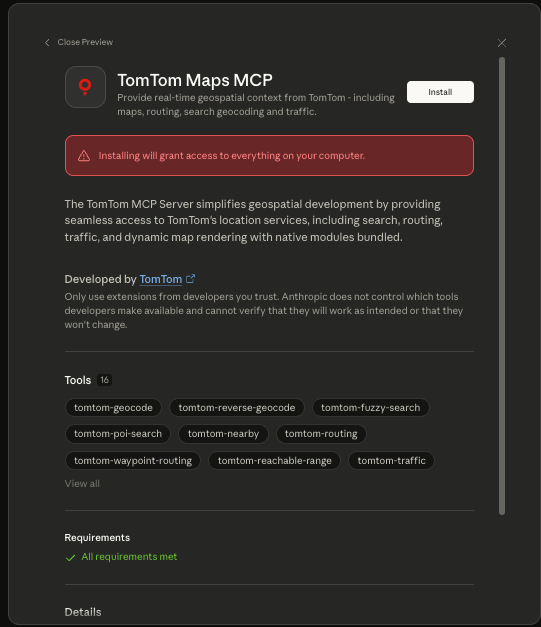
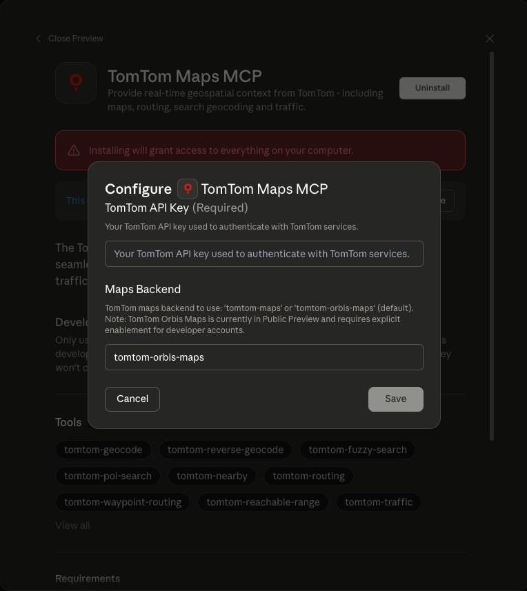
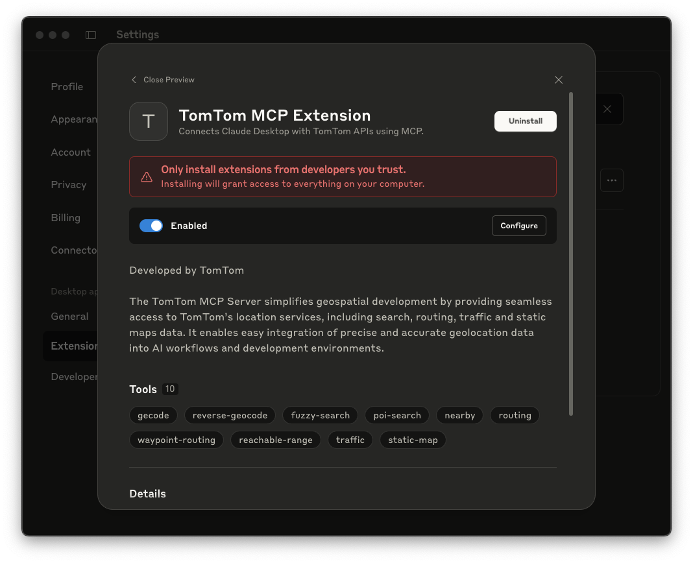
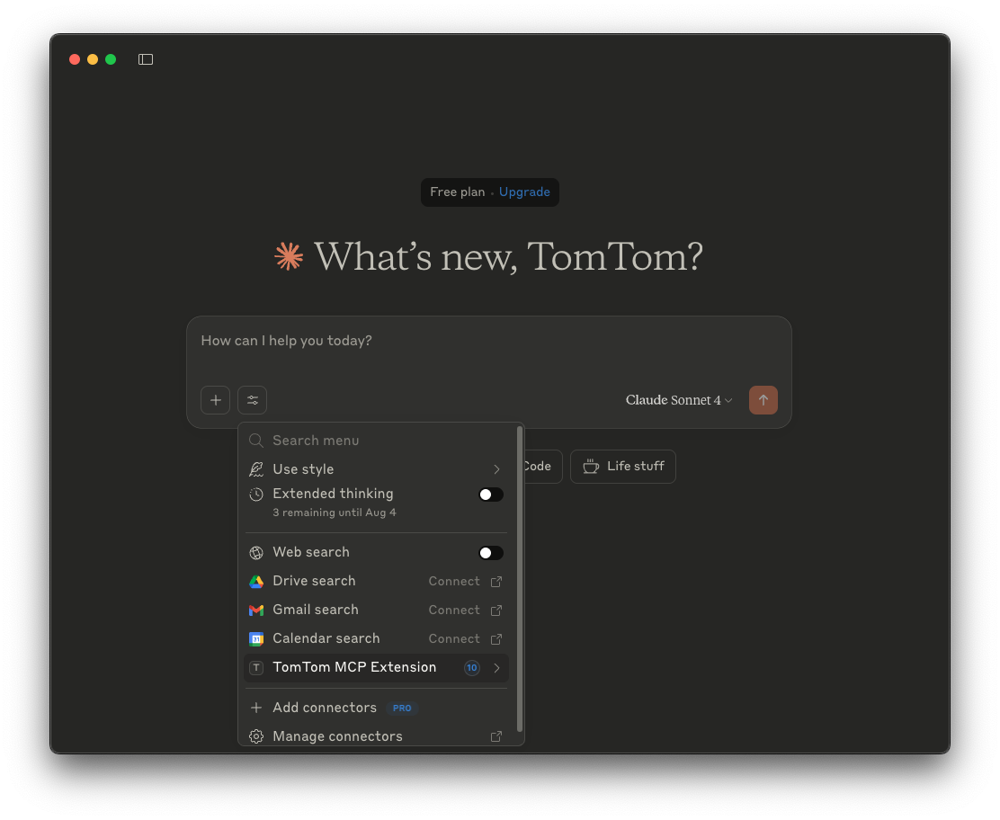
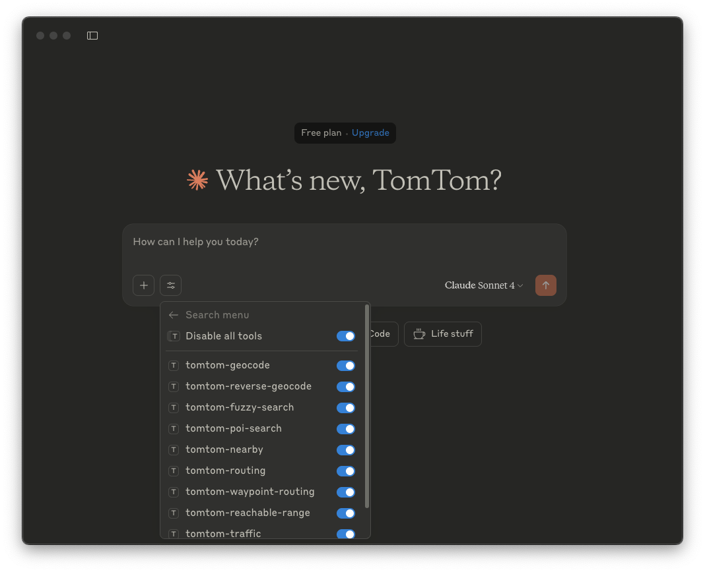

# Claude Desktop Integration Guide

This guide explains how to integrate Claude Desktop with the TomTom MCP Server to enable location-based tools using TomTom APIs.

## Prerequisites

- Claude Desktop installed (latest version recommended)
- Node.js 22x
- A valid [TomTom API key](https://developer.tomtom.com/)

## Setup
### Option 1: Install Claude Desktop Extension (Recommended)
1. Download one of the extension packages:
   - [⬇️ Download Latest (.mcpb format)](https://github.com/tomtom-international/tomtom-mcp/raw/refs/heads/main/tomtom-mcp.mcpb?download=) - Recommended
   - [⬇️ Download Previous Version (.dxt format)](https://raw.githubusercontent.com/tomtom-international/tomtom-mcp/main/tomtom-mcp.dxt) - For compatibility with older Claude Desktop versions

2. Open Claude Desktop → Settings → Extensions

3. Drag the downloaded extension file into the window and click Install
<p align="center"> </p>

4. When prompted, enter your TomTom API Key
<p align="center"> </p>

5. Once installed, Click enable, Claude can use the following tools from the TomTom MCP Extension.
<p align="center"> </p>

<p align="center"> </p>

<p align="center"> </p>

This method does not require Node.js installation, as Claude Desktop includes the necessary runtime environment.

### Option 2: Manual JSON Configuration (Advanced)
1. Add the following configuration to your `claude_desktop_config.json`:

    ```json
    {
      "mcpServers": {
         "tomtom-mcp": {
            "command": "npx",
            "args": ["-y", "@tomtom-org/tomtom-mcp@latest"],
            "env": {
               "TOMTOM_API_KEY": "<your_API_KEY>"
            }
         }
      }
   }
    ```

2. Restart Claude Desktop. You'll see the TomTom MCP tools in the Claude Desktop tools menu.


## Test It

Ask Claude a question like:

> "What’s the reachable range from Amsterdam within 30 minutes by car?"

If configured correctly, the MCP server will fetch results from TomTom APIs.

## Troubleshooting

- Ensure `TOMTOM_API_KEY` is valid and active.
- Check that the MCP server is accessible locally.
