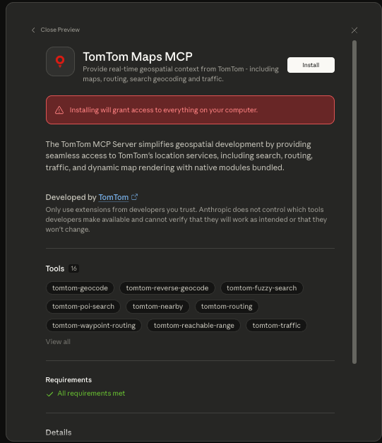
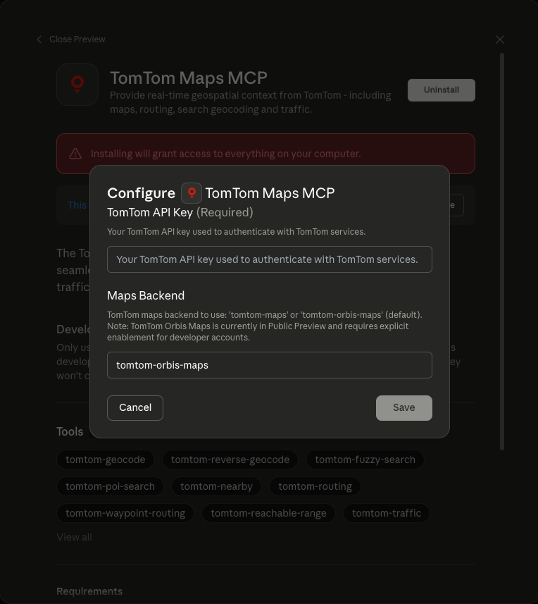
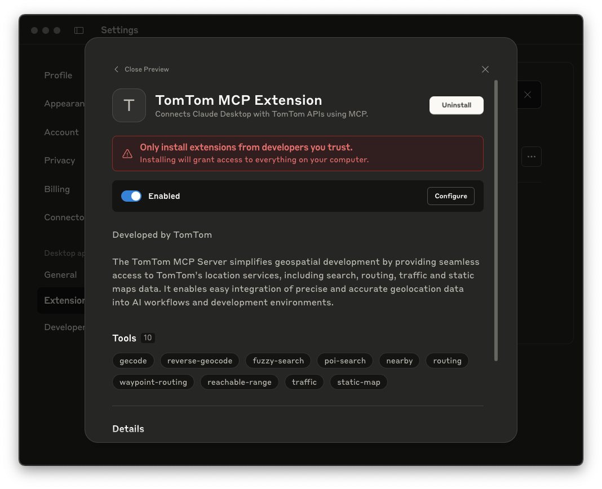
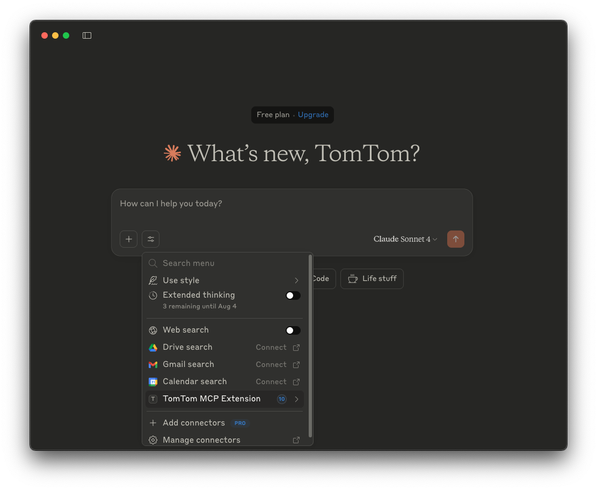
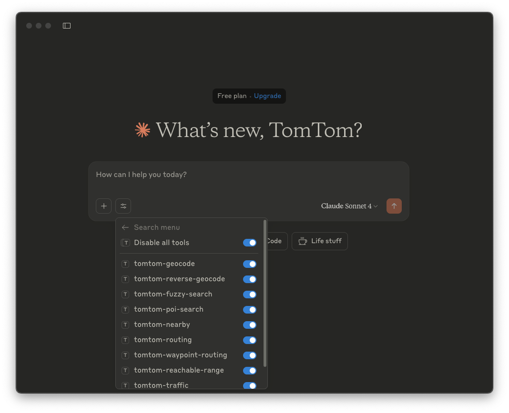

# Claude Desktop Integration Guide

This guide explains how to integrate Claude Desktop with the TomTom MCP Server to enable location-based tools using TomTom APIs.

## Prerequisites

- Claude Desktop installed (latest version recommended)
- A valid [TomTom API key](https://developer.tomtom.com/)

## Setup
### Option 1: Install Claude Desktop Extension (Recommended)

Each extension is a self-contained binary that bundles Node.js and all native dependencies — **no Node.js installation required**. Dynamic maps work out of the box.

1. Download the `.mcpb` file for your platform from [the latest release page](https://github.com/tomtom-international/tomtom-mcp/releases/latest):

   | Platform              | File                              |
   |-----------------------|-----------------------------------|
   | macOS (Apple Silicon) | `tomtom-mcp-darwin-arm64.mcpb`    |
   | Linux (x64)           | `tomtom-mcp-linux-x64.mcpb`      |
   | Windows (x64)         | `tomtom-mcp-win32-x64.mcpb`      |

2. Open Claude Desktop → Settings → Extensions

3. Drag the downloaded extension file into the window and click Install
<p align="center"> </p>

4. When prompted, enter your TomTom API Key
<p align="center"> </p>

5. Once installed, Click enable, Claude can use the following tools from the TomTom MCP Extension.
<p align="center"> </p>

<p align="center"> </p>

<p align="center"> </p>

### Option 2: Manual JSON Configuration (Advanced)

This method requires Node.js 22+ to be installed on your system.

1. Add the following configuration to your `claude_desktop_config.json`:

    ```json
    {
      "mcpServers": {
         "tomtom-mcp": {
            "command": "npx",
            "args": ["-y", "@tomtom-org/tomtom-mcp@latest"],
            "env": {
               "TOMTOM_API_KEY": "<your_API_KEY>"
            }
         }
      }
   }
    ```

2. Restart Claude Desktop. You'll see the TomTom MCP tools in the Claude Desktop tools menu.


## Test It

Ask Claude a question like:

> "What's the reachable range from Amsterdam within 30 minutes by car?"

If configured correctly, the MCP server will fetch results from TomTom APIs.

## Troubleshooting

- Ensure `TOMTOM_API_KEY` is valid and active.
- Check that the MCP server is accessible locally.
- If using **Option 1** (extension), make sure you downloaded the correct `.mcpb` for your platform (macOS/Linux/Windows).
- If dynamic maps are not working with **Option 2**, consider using Option 1 instead — it bundles all native dependencies.
