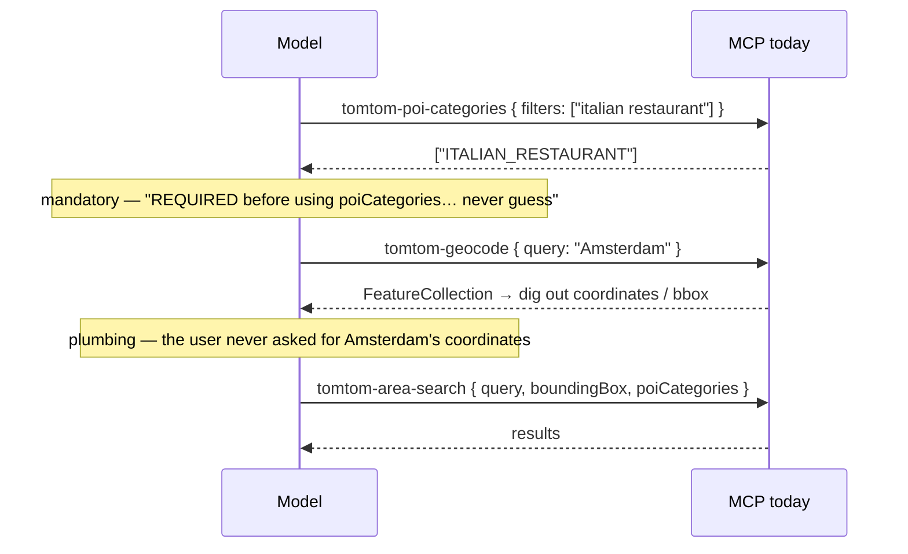

# Aligning the MCP tools with the Agent Toolkit

**Status:** proposal · **Author:** daniel.forniessoria · **Date:** 2026-08-24

## Goal

Make the MCP server able to answer questions over **large** API responses without
dumping them into the LLM's context — the same trick the agent toolkit's
`analyseData` / `processData` pull off — while keeping the MCP stateless, and
delete the layers that only exist to shrink payloads today.

Two things fall out of that:

1. **Code execution over server-held data.** The agent stops reading results and
   starts *querying* them.
2. **Cleanups.** Once the agent queries data instead of reading it, the trimmers,
   the caps, the `response_detail: "full"` escape hatch and most of the service
   wrappers have no job left.

---

## 1. Where we are

### The shape of every data tool today

```
tools/xTools.ts          registerAppTool(...)  — 60-line literal × 18
  └─ handlers/xHandler.ts  createXHandler()    — 15 near-identical factories
       ├─ services/x/xService.ts               — thin SDK param remapper
       ├─ handlers/shared/responseTrimmer.ts   — delete fields to save tokens
       └─ buildCompressedResponse()            — trimmed text + cached full data
```

Every one of the 15 handlers is the same five steps:

```ts
const { show_ui = true, response_detail = "compact", ...rest } = params;
const result = await someService(rest);
if (response_detail === "full") return { content: [{ type: "text", text: JSON.stringify(...) }] };
const trimmed = trimXResponse(result);
return await buildCompressedResponse(trimmed, result, show_ui);
// + an identical catch block
```

`response_detail === "full"` alone is copy-pasted **12 times**.

### The load-bearing insight

`buildCompressedResponse` **already stores the untrimmed response server-side**
(`services/cache/vizCache.ts`, `randomUUID` → `node-cache`, 5 min TTL) and hands
the agent a `viz_id` in `_meta`. Today only the MCP app reads it back, through the
app-only `tomtom-get-viz-data` tool.

> We already have handles to full server-side datasets. We just never let the
> model compute against them.

That is the whole proposal: **turn `viz_id` into a first-class dataset handle and
give the model a code-execution tool that reads it.**

### What we lose by dumping instead of querying

- `capTrafficIncidents` throws away real data — "showing the 100 most severe of
  3,412" — and the agent can never get the other 3,312 without re-querying with a
  narrower bbox.
- `trimGeoJSONFeatureProperties` deletes `openingHours`, `categorySet`,
  `classifications`, `score`, `entryPoints`. Any question that needs them is
  unanswerable, unless the agent asks for `response_detail: "full"` and blows its
  context.
- `trimRoutingResponse` deletes `guidance` and all `coordinates`, so "how many
  turns", "does this route cross a tunnel", "how far is the route from X" are all
  dead ends.
- 3,400 incidents at ~120 tokens each is ~400k tokens. Trimming buys a constant
  factor. Querying buys the whole problem.

---

## 2. Proposal

### 2.1 Datasets: rename `viz_id` → `dataset_id`, promote the cache to a store

`services/cache/vizCache.ts` becomes `services/datasets/datasetStore.ts`, storing
an envelope rather than a bare blob:

```ts
type Dataset = {
  id: string;               // "ds_9f2c…"
  kind: "places" | "routes" | "incidents" | "ranges" | "byod" | "mapState";
  data: unknown;            // untrimmed SDK / REST response
  summary: DatasetSummary;  // see 2.2
  provenance: { tool: string; params: unknown };  // see 2.5
  owner: string;            // see 2.6
  createdAt: number;
};
```

Every data tool returns `{ …summary, dataset_id }` instead of a trimmed dump.
The app-only fetch tool was renamed to `tomtom-get-dataset` and now reads
`dataset.data`. (The plan said it would "keep working unchanged"; since breaking
the surface is sanctioned, leaving one tool named after the old concept was not
worth the inconsistency.)

### 2.2 `tomtom-describe-dataset` — the stateless analog of `recallState`

Code generation only works if the model knows the *shape* of what it is querying.
The toolkit solves this with `buildEntryKindSchemaDocs` (static, per-kind docs);
statelessly we can do better and describe the actual data:

```
tomtom-describe-dataset({ dataset_id, sample?: 3 })
→ {
    kind: "places",
    count: 3412,
    geometry_types: ["Point", "LineString"],
    bbox: [...],
    properties: {                       // key → type + cardinality, not values
      "poi.name":            { type: "string", present: 3412, distinct: 2891 },
      "poi.categorySet":     { type: "array",  present: 3390 },
      "chargingPark.connectors[].currentType": { type: "string", distinct: 4,
                                                 values: ["AC1","AC3","DC","DCFast"] },
    },
    sample: [ /* 3 whole features, untrimmed */ ]
  }
```

`handlers/dataVizHandler.ts` already computes ~70% of this (`DataSummary`,
`computeBbox`, `property_names`, `numeric_properties`, `sample_properties`,
lines 95–140). Generalise it into `services/datasets/summarize.ts` and reuse it
for **every** kind — it becomes the default agent-facing response body, replacing
the trimmers.

Low-cardinality enums get their `values` inlined; that alone is what lets the
model write `c.currentType === "DCFast"` correctly on the first try.

### 2.3 `tomtom-analyse-data` — code execution over datasets

Direct port of `analyseData`, minus the state:

```
tomtom-analyse-data({
  dataset_ids: string[],          // instead of placesEntryIDs / routesEntryIDs / …
  code: string,                   // async-function body
  outputFormat?: "json" | "chart",
  name?, description?,
})
→ { analysis, outputFormat, datasetsUsed, elapsedMs }
```

Injected into the sandbox, mirroring the toolkit's naming so prompts transfer:

| binding | value |
|---|---|
| `datasets` | `Record<dataset_id, unknown>` — every requested dataset |
| `places`, `routes`, `incidents`, `ranges`, `byod` | merged view per kind, `undefined` when not requested |
| `turf` | `@turf/turf` v7 |
| `h3` | `h3-js` |

Reuse verbatim from `plugins/agent-toolkit/src/tools/shared/sandbox-code.ts`:

- `runSandboxedFn` / `SandboxExecutor` — the pluggable executor contract
- `stripInjectedRedeclarations` — kills the `const turf = require('@turf/turf')` habit
- `validateAnalysisResult` + `toJsonSafe` — the `undefined`/`NaN`/circular guard
- `formatSandboxExecutionError` + `SANDBOX_ERROR_HINTS` — 14 self-correction hints,
  the single highest-value thing in that file
- `buildSandboxCodePrompt` — the "what's in scope / what's forbidden" blurb
- `CHART_TYPES` / `isChartConfiguration` — `outputFormat: "chart"`

`outputFormat: "chart"` returns a Chart.js config. The MCP apps already render
client-side, so a `chart` app resource is a small addition and gives us charts over
3,000 incidents for ~300 tokens.

### 2.4 `tomtom-process-data` — derived datasets ✗ (phase 3, landed then removed)

> **Removed.** Shipped in phase 3 and never called: across five capability runs
> over thirteen tasks, `analyse-data` was used 27 times, `describe-dataset` 5 and
> `process-data` 0. The corpus asks questions *about* data and never asks for a
> derived layer to draw, so this is an unexercised design rather than a refuted
> one — the section below stands as the argument to revisit if that changes. What
> its removal costs is named in the PR: a filtered or clustered layer must now
> come back through the conversation as inline GeoJSON to be drawn.

Same sandbox, but the return value is **stored as a new dataset** and its
`dataset_id` returned. Chains cleanly and feeds the map:

```
tomtom-poi-search       → ds_a (2,400 EV stations)
tomtom-process-data     → ds_b (filter DCFast, cluster by h3 res 7)  → 40 clusters
tomtom-dynamic-map      → renders ds_b directly by dataset_id
```

This is the stateless equivalent of the toolkit writing a new places /
custom-geometries entry — and it removes today's need to round-trip GeoJSON
through the model to get it onto a map. `tomtom-dynamic-map` and
`tomtom-data-viz` gain a `dataset_id` input alongside inline/URL GeoJSON.

### 2.5 Statelessness — the honest version

The cache is a per-process singleton with a 5-minute TTL. Three consequences to
handle explicitly:

1. **TTL.** 5 minutes is tuned for "the app fetches right after the tool call",
   not for multi-turn analysis. Raise datasets to ~30 min with an LRU byte cap
   (`node-cache` has no size bound today — a 50 MB BYOD upload sits in RSS for the
   full TTL, and `useClones: false` means we hand out live references).
2. **Horizontal scaling.** ⚠️ **Revised.** The plan was to transparently re-run the
   originating call on a miss. Implementing it surfaced two problems. The small
   one: provenance lived inside the entry that expires, so an expired id carried
   nothing to replay from — fixed with a separate provenance index at 4x the TTL
   (it holds a tool name and params, so keeping it longer is free). The
   disqualifying one: **replay is not sound for time-varying data.** Re-running a
   traffic query 40 minutes later returns different incidents, and an analysis over
   them would silently describe a different world than the id implied. A wrong
   answer that looks right is worse than a miss.

   So a miss is now *specific* rather than automatic: the caller is told exactly
   which call produced the dataset and that a refetch may differ. Auto-replay may
   still be right for the deterministic kinds — a geocode is stable in a way
   traffic is not — but that is a per-kind judgement and deliberately not made yet.
3. **Tenant scoping.** ✅ **Landed in phase 1, earlier than this section planned.**
   The plan put it here because `analyse-data` is what makes `dataset_id` an
   LLM-addressable read primitive — but `describe-dataset` does that too, and it
   shipped in phase 1, so the scoping had to come with it. Entries are keyed by a
   SHA-256 digest of the resolved key (never the key itself), and a cross-owner
   read returns the same "not found" as a genuine miss so the store cannot be
   probed. Covered by `dataset-store.test.ts`.

### 2.6 Sandbox isolation — ✅ resolved, differently than planned

This section recommended a `WorkerThreadExecutor`. **That turned out to be unsafe,
and the way it failed is worth recording** because it looked like it worked.

Node's permission model (`--permission`) can be passed per-thread through a
worker's `execArgv`, and every surface signal says it took effect:
`process.permission` is present, `permission.has("fs.read")` is `false`, and
reading `/etc/hosts` fails with `ERR_ACCESS_DENIED`. But **a worker cannot have
its own working directory**, and worker-level `--permission` leaves the cwd
readable. Measured consequence: a sandboxed body could read `<repo>/.env` — the
server's own TomTom API key — while the harmless path was correctly denied. A
boundary that blocks `/etc/hosts` and allows the credential is worse than none,
because it reads as safe.

The shipped executor is therefore a **jailed child process**
(`src/tools/shared/sandbox/process-executor.ts`): its own `cwd` pointed at an
empty temp directory, `--permission` with a single read grant covering
`node_modules`, `env: {}`, `--max-old-space-size`, and `SIGKILL` on timeout.
Every row below is asserted in `process-executor.test.ts`, not assumed:

| Capability | Status |
| --- | --- |
| Read the server's `.env` or any repo file | **denied** (`ERR_ACCESS_DENIED`) |
| Read anything outside `node_modules` | **denied** |
| Read env / credentials | **denied** (`env: {}`; only macOS's `__CF_USER_TEXT_ENCODING` survives) |
| Spawn a subprocess | **denied** |
| Exceed 512 MB heap | **denied** |
| Run past 10s | **denied** (`SIGKILL`) |
| **Network egress** | **NOT denied** |

The global shadowing in `sandbox-code.ts` is a tripwire and nothing more — a
constructor walk reaches the real `globalThis` from inside the child, and there
is a test asserting exactly that so nobody mistakes the shadows for the boundary.
What holds is the process options.

**Residual risk: network.** Node's permission model does not cover sockets, so
`fetch` stays reachable. A body could POST the dataset it was handed to an
external host. It cannot reach another caller's datasets (analysis is owner-scoped
through the store) or the server's credentials, so the exposure is bounded by what
that caller could already read through the tool surface. Closing it needs an
egress policy at the container level — **the one thing still to settle before
enabling `analyse-data` on the shared endpoint.**

The cost of the process boundary over a thread is ~50ms of startup and a JSON
round-trip instead of a structured clone. For a tool that follows a network call,
that is not the constraint.

### 2.7 Sharing the sandbox code

Three options, in increasing order of effort:

| | approach | pro | con |
|---|---|---|---|
| A | vendor `sandbox-code.ts` (~470 lines) into tomtom-mcp | zero dependency risk, land today | drift |
| B | **add `"./sandbox"` to agent-toolkit's `exports`** | one source of truth, cheap | new public subpath to support |
| C | extract a `shared/sandbox` workspace package | cleanest | monorepo + publishing change |

**Recommend B.** `sandbox-code.ts` imports only *types* from
`@tomtom-org/maps-sdk/core` and `chart.js`, so a subpath export pulls in no
runtime peer — the reason we can't use the current entrypoint is that `.` reaches
`create-map-agent` → `ai` → `maplibre-gl`. tomtom-mcp already depends on
`@tomtom-org/maps-sdk`, so this adds `@turf/turf` (present) and `h3-js` (new).

---

## 3. Cleanups

Ordered by lines removed per unit of risk.

### 3.1 `handlers/shared/responseTrimmer.ts` — delete ~350 of 448 lines

`trimSearchResponse`, `trimRoutingResponse`, `trimTrafficResponse`,
`trimReachableRangeResponse`, `capTrafficIncidents`,
`trimGeoJSONFeatureProperties`, `trimFeatureCollectionMetadata` all exist to make
a dump fit. Replaced by `summarize()` + `describe-dataset` + `analyse-data`.
`buildCompressedResponse` survives, renamed, returning `{ summary, dataset_id }`.

Also retires `schemas/shared/responseOptions.ts` (`response_detail`) and its 12
copy-pasted call sites: "compact" becomes the only response, and "full" becomes
`analyse-data` with `return incidents` (or `describe-dataset` with a bigger
`sample`).

### 3.2 A tool registry instead of 18 `registerAppTool` literals

The toolkit keeps name / description / schemas / metadata in one
`tool-registry.ts` table. Do the same: `tools/registry.ts` with one row per tool
and a single `registerTools()` loop that wires the resource URI, annotations
(`readOnlyHint: true, destructiveHint: false, idempotentHint: true` is identical
on all 18) and handler. Collapses `tools/*Tools.ts` from 580 lines to a table, and
makes tool-surface review a one-file diff.

### 3.3 Handlers: one `defineDataTool` helper

The 5-step pipeline becomes a wrapper; each tool keeps only its `execute`:

```ts
// before: ~28 lines per handler × 15
// after:
export const geocode = defineDataTool({
  name: "tomtom-geocode",
  kind: "places",
  execute: ({ query, ...opts }) => geocodeAddress(query, opts),
});
```

`defineDataTool` owns: dataset store write, summary, `show_ui` plumbing, the
`handleApiError` + `logger.error` catch block. Roughly **1,300 handler lines →
~350**.

### 3.4 `services/search/searchService.ts` — 554 lines, mostly mechanical

- `searchPlaces` (line 70) has **zero call sites** — dead code, delete.
- `fuzzySearch`, `poiSearch`, `geocodeAddress`, `searchNearby` are the same
  `if (options?.x !== undefined) params.x = options.x` ladder, differing only by
  `indexes` / `countrySet` vs `countries`. Replace the ladder with a
  `compact({...})` helper and let one function take the index set.
- The `as Parameters<typeof search>[0]` casts are papering over schema types being
  wider than SDK types (`number[]` vs `BBox`, `string` vs `Language`). Fix at the
  schema layer (`z.tuple` for bbox, the SDK enum for language) and the casts —
  and the "schema types are more permissive" comments repeated in every handler —
  disappear.

### 3.5 `services/base/tomtomClient.ts` — 225 lines for one call site

Since the SDK migration, `tomtomClient.get` has exactly **one** consumer:
`trafficService.ts:71` (`/maps/orbis/traffic/incidentDetails`). The file bundles
three unrelated concerns and everything imports it for the third:

- an axios instance + request/response interceptors → move next to traffic as
  `services/traffic/trafficRest.ts`, or drop axios for `fetch`
- API-key resolution + `AsyncLocalStorage` session context → `services/apiKey.ts`
  (this is what 8 files actually want)
- `isHttpMode` / `serverUserAgentName` mutable module-level `let`s → fold into
  `appConfig.ts`

`API_VERSION` only still matters for the one traffic path.

### 3.6 Naming

Adopt the toolkit's `kebab-case.ts` file naming (`response-trimmer.ts`,
`search-service.ts`) — the MCP is the only one of the two on camelCase, and the
directories are about to be shuffled anyway.

---

## 4. Converge the tool surface (phase 4)

### 4.1 The problem is the shape, not the count

The 15 tools are a mirror of the TomTom API catalog: one tool per endpoint, taking
roughly the parameters that endpoint takes. That pushes all the *joining* onto the
model. "Italian restaurants in Amsterdam" is three round trips, two of them pure
plumbing:



Each hop is a full model turn: tokens in, tokens out, another chance to pick the
wrong tool or mis-transcribe a bbox. The toolkit does the same job in **one** call:

```ts
discoverPlaces({
  poiCategories: ["italian food"],                    // natural language is fine
  where: { mode: "within", queries: [{ query: "Amsterdam" }] },
})
```

Nothing was moved to the client. Two resolvers inside the tool absorbed the hops.

### 4.2 The two resolvers that remove the hops

**`resolvePoiCategories`** (`tools/shared/resolve-poi-categories.ts`) takes a
**mixed** list. Exact catalog codes pass through; anything else is resolved against
the category catalog (warmed once, then served from memory), and terms that match
nothing come back in `unresolved[]` so the tool can say precisely what failed.

That single detail deletes a mandatory hop. Our `tomtom-poi-categories`
description currently reads *"REQUIRED before using poiCategories in any search
tool… Never guess or hardcode category codes"* — which is honest, because today the
search tools only accept codes. Make the search tool resolve terms itself and the
category tool becomes an **optional** lookup for when the model wants to browse the
vocabulary, not a toll gate on every category search.

**`resolveWhere`** (`tools/shared/resolve-where.ts`, 295 lines) turns a `where`
object into search geometry. Any combination of:

| `where` field | Resolves to |
| --- | --- |
| `queries: [{ query, queryAs? }]` | Geocode the area name → fetch its **boundary polygon** when available, else its bbox |
| `boundingBox` | Used directly |
| `placeIds` | A place/entry already in state → its polygon, fetched on demand |
| `geometries` | Caller-supplied GeoJSON Polygon / MultiPolygon |
| `range` | A stored isochrone entry |
| `route: { routeId?, widthMeters }` | `turf.buffer` around the route line → a corridor |
| `viewport: true` | The current map bounds (fallback only) |

Explicit fields are **unioned**; the viewport is used only when nothing explicit
resolved. Each `queries` entry is narrowed to a single winner before joining the
pool, so an ambiguous name can't leave several wrong-location areas in the scope.

Note what `queries` buys beyond saving a call: a *boundary polygon*, not a
bounding box. "Restaurants in De Jordaan" searched against a bbox returns
half of central Amsterdam. Our `tomtom-area-search` can already take a polygon —
but only if the model somehow has one, and no MCP tool returns one today.

### 4.3 The location union — where "fewer hops" bites hardest

`tomtom-routing` takes `locations: Position[]` — raw `[lng, lat]`. So "route from
Amsterdam Centraal to the Rijksmuseum" is: geocode, geocode, route. Three calls to
express one sentence, and the model hand-copies four floats between them.

The toolkit's `locationInputSchema` (`tools/shared/location-input.ts`) is a union
of three ways to name a place:

```ts
| { query: string, queryAs: "poi" | "place" }   // resolve text inline
| { position: [lng, lat] }                      // already have coordinates
| { placeIdOrEntryId: string }                  // reuse an earlier result
```

So the whole sentence is one call:

```ts
setRoute({ locations: [
  { query: "Amsterdam Centraal", queryAs: "poi" },
  { query: "Rijksmuseum",        queryAs: "poi" },
]})
```

And because it's a shared schema, the same three shapes work as `origins` for
`findReachableAreas` — every tool that means "a place" accepts every way of saying
one. `queryAs` is the disambiguator (`poi` = venue/landmark/business, `place` =
address/city/neighborhood/postal code), which is exactly the distinction our
separate `geocode` and `poi-search` tools encode as *two tools*.

**For a stateless MCP the third variant changes meaning**, and this is where
phase 1 pays off twice: `placeIdOrEntryId` becomes `dataset_id` (optionally plus a
feature id). The dataset handles introduced for `analyse-data` become *inputs* too:

```ts
tomtom-plan-route({ locations: [
  { dataset_id: "ds_a", featureId: "poi-3" },   // a station from an earlier search
  { query: "Rijksmuseum", queryAs: "poi" },
]})
```

That is the stateless equivalent of the toolkit's session-state reuse, and it
removes the "re-search for the place you already found" hop as well.

### 4.4 Proposed surface: 15 → 7 (+1 optional)

| New tool | Input shape | Replaces |
| --- | --- | --- |
| **`tomtom-discover-places`** | `{ query?, poiCategories?, where?, limit? }` | `fuzzy-search`, `poi-search`, `nearby`, `area-search`, `ev-search`, `search-along-route`, multi-hit `geocode` |
| **`tomtom-locate-place`** | `{ query, queryAs, where?, geometry? }` | single-hit `geocode` — and it's what finally *returns* boundary polygons |
| **`tomtom-reverse-geocode`** | `{ position }` | itself — genuinely the opposite direction, keep it |
| **`tomtom-plan-route`** | `{ locations: LocationInput[], parameters? }` | `routing`, `ev-routing` (EV is a `parameters` branch, not a tool) |
| **`tomtom-find-reachable-areas`** | `{ origins: LocationInput[], budgets[] }` | `reachable-range` — and `budgets[]` gives nested isochrones in one call instead of one call per budget |
| **`tomtom-get-traffic`** | `{ where }` | `traffic` — same `where` resolver, so "traffic in Amsterdam" needs no geocode hop and "traffic on my route" is a corridor |
| **`tomtom-show-map`** | `{ dataset_ids?, markers?, geometries?, layers? }` | `dynamic-map`, `data-viz` — they differ only by dataset size, which the tool can measure itself |
| `tomtom-poi-categories` | `{ filters }` | itself, **demoted to optional** |

`where` is one field with four modes, and that union is what collapses seven
search tools into one:

| mode | Scope | Absorbs |
| --- | --- | --- |
| `within` | Area — `queries` / `boundingBox` / `geometries` / `placeIds`\|`dataset_id` / `range` / `route` corridor | `area-search`, `search-along-route` (corridor) |
| `nearby` | Point bias + `radiusMeters` | `nearby` |
| `maxDetour` | Ranked detour off a route | `search-along-route` (ranked) |
| `global` | No bias | `fuzzy-search`, `poi-search` |

### 4.5 What this does to hop counts

| Task | Today | Proposed |
| --- | --- | --- |
| "Italian restaurants in Amsterdam" | 3 (`categories` → `geocode` → `area-search`) | **1** |
| "Route from Amsterdam Centraal to the Rijksmuseum" | 3 (`geocode` ×2 → `routing`) | **1** |
| "EV chargers within 20 min of Utrecht Centraal" | 3 (`geocode` → `reachable-range` → `ev-search`, and the polygon is trimmed away so the last step can't actually filter) | **2** |
| "Traffic in Amsterdam" | 2 (`geocode` → `traffic` with a hand-built bbox) | **1** |
| "Coffee within 5 min detour of my route" | 2 (`routing` → `search-along-route`, recomputing the route) | **1** (`maxDetour` off the stored route dataset) |
| "10, 20 and 30-minute isochrones from the depot" | 4 (`geocode` → `reachable-range` ×3) | **1** |

Fewer hops is not only latency and tokens. Every hop is a chance to drop data at a
tool boundary — the EV example fails *today* not because of hop count but because
`trimReachableRangeResponse` deletes the polygon between step 2 and step 3.

### 4.6 What the MCP must adapt

Not everything ports. Three deliberate divergences:

1. **No viewport.** The toolkit's resolver falls back to map bounds and reranks
   geocode candidates by distance to the viewport centre. A stateless server has
   neither, so drop `viewport: true` — and accept that **ambiguity resolution is
   weaker**: nothing distinguishes Springfield MO from Springfield IL. Mitigation:
   `locate-place` returns candidates with labels when the top match is not clearly
   ahead, rather than silently guessing.
2. **State handles become dataset handles.** `placeIds` / `range` / `route.routeId`
   all reference session entries. They become `dataset_id`, which means **phase 4
   depends on phase 1**, not just on the descriptions.
3. **`show` / `showOnMap` don't port.** The toolkit mutates a live map; the MCP has
   `show_ui` plus an app per tool. Seven tools means seven apps, so six of today's
   fifteen app directories retire — delete them in the same commit
   (see [`../tools-architecture.md`](../tools-architecture.md), "Orphaned apps are silent").

### 4.7 The risk this design carries, and the gap in our evals

Wider tools fail differently. The dominant failure is the model putting the search
*subject* in the `where` scope — `where.queries: [{ query: "restaurants" }]` instead
of `poiCategories: ["RESTAURANT"]`. The toolkit spends real description budget
fighting exactly this (*"NEVER the user's search subject — that goes in the
top-level `query`"*, repeated on both fields), which tells you how often it happens.

Until recently our eval harness could not catch it: `evals/scenarios/` asserted
only *which* tool was called, and with one tool absorbing seven, "did it call
`discover-places`?" is trivially true and measures nothing.

- ✅ **`expectToolCalledWith(run, name, predicate)`** — **landed.** Asserts argument
  shape, so "restaurants in Amsterdam" can require `poiCategories` non-empty **and**
  `where.queries[0].query === "Amsterdam"`. Reachable declaratively from a scenario
  via `expectedArgs`, with `expectEveryToolCallWith` for invariants. Unit-tested in
  `evals/harness/scenario.test.ts` (no credentials needed), and already used on
  today's surface by two scenarios in `search.test.ts` — one asserting the resolved
  category code is actually *carried into* the search rather than the hop merely
  happening, one asserting the region lands in the geometry and not in `query`.
  Those two are the baseline the collapse has to preserve.
- **Re-pointed `examplePrompts`.** All 15 current tools' prompts must keep landing
  correctly on the new surface; the registry rows move, the prompts don't.
- **`toolFriction` read first.** The capability judge already reports which
  descriptions a model was seen tripping over — that is the input to writing the
  new descriptions, so run the benchmark before redesigning, not after.

## 5. Phasing

| phase | scope | risk | breaking? |
|---|---|---|---|
| **0** ✅ | Pure cleanups: dead `searchPlaces`, split `tomtomClient`, `defineDataTool`, tool registry, kebab-case, **eval suites** | low | no |
| **1** ✅ | Dataset store + `summarize()` + `tomtom-describe-dataset`; `viz_id` → `dataset_id` | low | yes — `viz_id` gone |
| **2** ◐ | `tomtom-analyse-data` + jailed-process sandbox + provenance index; `response_detail` deleted. **Field trimmers kept** — see below | medium | yes — `response_detail` gone |
| **3** ✅ | `tomtom-process-data`; `dataset_id` input on `data-viz` (not `dynamic-map` — see below) | medium | no |
| **4** ✅ | Tool surface collapsed 18 → 12. `show-map` deliberately not merged — see below | high | yes — sanctioned |

Phases 0–1 are safe to land on this branch's heels. Phase 2 is the one that needs
a decision on isolation (§2.6) and tenant scoping (§2.5.3) before it can ship to
`mcp.tomtom.com`.

Backward compatibility is **not** a constraint on any phase: breaking the tool
surface and the MCP apps is sanctioned, so the sequencing above is driven by
technical risk and dependencies alone, not by what clients currently depend on.

Phase 4 is last for a reason, and it is a dependency rather than a preference: its
location union needs `dataset_id` handles to express "the place I already found"
and "the route I already planned" (§4.3), and those arrive in phase 1. Attempting
phase 4 first would mean rebuilding the tool surface twice.

### Phase 4 — landed

| What | Where |
| --- | --- |
| `locationInput` union — `{query,queryAs}` \| `{position}` \| `{dataset_id,featureIndex}` | `src/tools/shared/inputs/location-input.ts` |
| `where` resolver — `within` / `nearby` / `global`, areas resolved to boundary polygons, routes to corridors | `src/tools/shared/inputs/resolve-where.ts` |
| Mixed code-or-natural-language category resolution | `src/tools/shared/inputs/resolve-poi-categories.ts` |
| `tomtom-discover-places` — absorbs `fuzzy-search`, `poi-search`, `nearby`, `area-search`, `ev-search`, `search-along-route` | `src/tools/services/discover-places.ts` |
| `tomtom-locate-place` — absorbs `geocode`, and is the only tool that returns boundaries | same file |
| 5 orphaned search apps + the duplicate `ev-routing` app retired with their tools | `src/apps/` |

**18 model-visible tools → 13.** Seven retired for two.

Verified rather than assumed: the eval scenarios keep all seven retired tools'
`examplePrompts` and now assert **argument shape** as well as tool choice
(`where.mode`, region-not-in-`query`, `poiCategories` present, `includeGeometry`
for a boundary request). That is the safety net §4.7 said had to exist before the
collapse, and it is exercising it.

The routing and traffic tools followed:

| New tool | Replaces | What the shared inputs bought |
| --- | --- | --- |
| `tomtom-plan-route` | `routing`, `ev-routing` | `locations: locationInput[]` — name places directly, no geocode hop. `ev` is a FIELD, so EV stops being a second route-shaped tool the model has to choose between on a distinction the prompt often omits |
| `tomtom-find-reachable-areas` | `reachable-range` | `origins: locationInput[]` plus `budgets[]` — nested rings (10/20/30 min) in ONE call instead of one per budget |
| `tomtom-get-traffic` | `traffic` | `where` — name the area instead of hand-building a bbox; a route corridor or a stored reachable-range polygon works too |

**18 model-visible tools → 12.** The count only drops by six because three of
these are 1:1 replacements; the win there is hop removal, not count reduction.

Retiring `ev-routing` also retired its app — and that turned out to be free.
The two routing apps differed by **13 substantive lines**, all cosmetic: the EV
app's own header records that `RoutingModule.showRoutes()` "natively extracts and
renders charging stops from leg sections", so `route-planner` renders an EV route
identically. Verified by diff before deleting.

#### `tomtom-show-map` — deliberately not merged

§4.4 proposed merging `dynamic-map` and `data-viz`. Checking the MCP apps contract
first changed the answer. The SDK is explicit that the UI resource is bound to the
**tool definition**: *"MCP servers include this key in tool definition metadata
(via `tools/list`) to indicate which UI resource should be displayed when the tool
is called."* A tool result cannot select its own app.

So one merged tool can advertise only one app, and the two renderers are not
near-duplicates the way the routing pair was — 796 lines of markers / lines /
polygons / route-plans versus 979 lines of clusters / heatmaps / choropleths. The
tool-schema union is an hour; **merging the renderers is the actual work**, and
shipping the union without it would silently break one of the two rendering paths
— the most visible thing in the product.

The distinction the two tools currently draw (a few discrete elements vs. a
dataset) is real, stated in both descriptions, and asserted in both directions by
the eval scenarios. Merging them is a front-end task worth its own piece of work,
not a tail of a tool-surface phase.

One thing measured while building: with no viewport, `locate-place` cannot re-rank
ambiguous names the way the toolkit does (§4.6). Rather than silently taking the
geocoder's top hit, it now returns the runner-up names as `alternatives` with a
note to disambiguate via `where` — the honest version of a capability we do not
have.

### Phase 3 — landed

| What | Where |
| --- | --- |
| `tomtom-process-data` — derive a new dataset, get back a handle | `src/tools/services/process-data.ts` |
| `dataset_id` as a data-viz source, alongside `data_url` / `geojson` | `src/schemas/dataViz/dataVizSchema.ts` |
| Shared GeoJSON normalisation, extracted from data-viz | `src/services/datasets/geojson.ts` |

The chain the phase exists for now runs with nothing large crossing the
conversation, and there is a test asserting exactly that:

```
tomtom-ev-search    → ds_a  (900 stations)
tomtom-process-data → ds_b  (filter DC-fast)   → 300 features, handle only
tomtom-analyse-data → count over ds_b          → 300
tomtom-data-viz     → draws ds_b by id
```

Two deliberate deviations:

- **`dataset_id` was NOT added to `tomtom-dynamic-map`.** This section said "on
  `dynamic-map` / `data-viz`", which over-specified. `dynamic-map` takes discrete
  markers/lines/polygons and its own description says to use `data-viz` for
  datasets; adding a dataset source to both would create two paths to the same
  outcome and blur a distinction the tool descriptions currently keep sharp. If
  phase 4 merges the two into `tomtom-show-map`, the merged tool takes it.
- **An empty result stores nothing.** "Nothing matched" is a real answer, so the
  tool reports `featureCount: 0` with a note rather than handing back a handle
  whose emptiness only surfaces when something later tries to draw it.

The `data_url` / `geojson` / `dataset_id` descriptions now rank themselves by cost
(`dataset_id` cheapest, inline `geojson` most expensive), because the model
choosing between three sources is the actual decision being made.

### Phase 2 — mostly landed

| What | Where |
| --- | --- |
| `tomtom-analyse-data` — code execution over datasets, `turf` + `h3` in scope | `src/tools/services/analyse-data.ts` |
| Sandbox core, vendored from the toolkit (error hints, redeclaration stripping, JSON coercion) | `src/tools/shared/sandbox/sandbox-code.ts` |
| Jailed-child-process executor — see §2.6 | `src/tools/shared/sandbox/process-executor.ts` |
| Provenance index, so an expired id can name its originating call | `src/services/datasets/dataset-store.ts` |
| `response_detail` deleted: schema field, the `full` branch, `schemas/shared/responseOptions.ts` | — |

**Deliberately NOT done: deleting the field trimmers.** §3.1 planned to delete
~350 lines of `response-trimmer.ts` and return a summary as the default response.
Two reasons to stop short:

1. **It would add a hop to every simple lookup.** "What are the coordinates of Dam
   Square" is answerable today from the projection in one call. With only a summary
   plus a `dataset_id`, the model needs a second call to read its own result. That
   is the opposite of the direction §4 argues for, and it is a worse trade than the
   token saving is worth.
2. **The instrument that would catch a regression cannot run.** The capability
   benchmark is the only way to tell whether `analyse-data` genuinely replaces the
   projections, and it has never been run — no model credentials
   ([`../../evals/README.md`](../../evals/README.md)).

The trimmers' actual sin was never *projecting*; it was **projecting with no way to
recover what was dropped**, and silently implying completeness. Both are now fixed:
every projection carries a `dataset_id`, and the full payload is queryable. The
revised recommendation is to keep the projections, and instead audit them for
honesty — `capTrafficIncidents` should point at the dataset rather than just
saying "narrow the bbox". That is a much smaller change than the deletion, and it
should follow a recorded baseline rather than precede one.

### Phase 1 — landed

| What | Where |
| --- | --- |
| Dataset store: envelope (`kind` / `summary` / `provenance` / `owner`), 30-min TTL, owner scoping, 256 MB + 500-entry budget | `src/services/datasets/dataset-store.ts` |
| Shared `summarize()` — property paths with type, presence, cardinality, and inlined vocabularies for low-cardinality fields | `src/services/datasets/summarize.ts` |
| `tomtom-describe-dataset` | `src/tools/services/describe-dataset.ts` |
| `viz_id` → `dataset_id`; `tomtom-get-viz-data` → `tomtom-get-dataset` | wire format, apps, protocol tests |
| `services/viz-cache.ts` deleted; data-viz's private `computeSummary` (162 lines) replaced by the shared one | — |

Two things landed differently from the plan above:

- **Owner scoping moved up from phase 2** (§2.5.3) — `describe-dataset` makes
  `dataset_id` model-addressable, so the scoping could not wait for `analyse-data`.
- **`show_ui: false` now still stores.** It used to skip the cache because the app
  was the only consumer; `describe-dataset` needs the payload regardless.

`provenance` is recorded but **not yet replayed**: a miss returns an actionable
"re-run the tool that produced it" rather than silently re-fetching. The replay
machinery stays in phase 2 with `analyse-data`.

### Phase 0 — landed

| What | Where |
| --- | --- |
| Tool registry: one row per tool, replacing 18 `registerAppTool` literals | `src/tools/tool-registry.ts`, `src/tools/register.ts` |
| `defineDataTool` — the 5-step pipeline, extracted from 15 handler factories | `src/tools/shared/define-data-tool.ts` |
| `src/handlers/**` → `src/tools/services/**` (toolkit layout, kebab-case) | `src/tools/services/` |
| `tomtomClient` split: key resolution vs. the one-endpoint axios client | `src/services/api-key.ts`, `src/services/traffic/traffic-rest.ts` |
| `compact()` / `nonEmpty()` replacing the `if (x !== undefined)` ladders | `src/services/params.ts` |
| Dead `searchPlaces` deleted; `requireApiKey()` replacing 9 copies of its preamble | `src/services/search/searchService.ts` |
| Tool-selection evals, prompts sourced from registry `examplePrompts` | `evals/scenarios/` |
| Capability benchmark + LLM judge with a grounding veto | `evals/capability/` |

Terminology now shared with the toolkit: `ToolEntry`, `TOOL_NAMES`,
`DEFAULT_TOOLS`, `TOOL_TAGS`/`ToolTag`, `getDefaultToolPrompts()`, `execute`,
`examplePrompts` / `tags` / `relatedTools` / `dependsOn`, and the whole
`createToolScenarioRunner` / `expect*ToolCalled` / `priorTurn` eval surface.

**Phase 2's success criteria are now measurable.** `evals/capability/tasks.ts`
labels 9 of 13 tasks `expected: "blocked"`, each with the exact `blockedBy`
reason — `capTrafficIncidents` truncating to 100 rows,
`trimGeoJSONFeatureProperties` deleting `openingHours`, `trimRoutingResponse`
deleting `guidance` and `coordinates`. Phase 2 should turn `blockedButAnswered`
from 0 into most of 9 while holding `fabricationRate` at 0 and *reducing*
`totalTokens`. Run `pnpm evals:capability` before starting phase 1 to record the
baseline.

## 6. Open questions

1. Sandbox sharing: subpath export (recommended) vs vendoring vs a new package?
2. `WorkerThreadExecutor` — upstream in the toolkit, or MCP-local?
3. Is provenance-replay acceptable as the scaling answer, or do we want a shared
   store? Replay double-charges the upstream API on a cache miss.
4. Is a `chart` MCP app resource in scope, or does `outputFormat: "chart"` wait?
5. Phase 4 lands a breaking tool surface — do we ship it behind a major version
   bump, and does the hosted `mcp.tomtom.com` endpoint need to serve both surfaces
   during the transition, or does it cut over with the package?
6. Without a viewport, `locate-place` cannot rerank ambiguous names the way the
   toolkit does (§4.6). Do we return candidates and let the model choose, take the
   geocoder's top hit, or add an optional caller-supplied bias position — and if
   the latter, does anything upstream of the MCP actually know the user's location?
7. Do we reuse the toolkit's `resolve-where` / `location-input` / 
   `resolve-poi-categories` modules directly (they are exported, and §2.7's
   subpath-export decision would cover them), or re-implement stateless versions?
   They reach into `ToolState` for the viewport and entry expansion, so it is a
   real port rather than an import.
