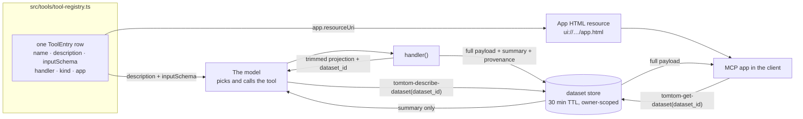
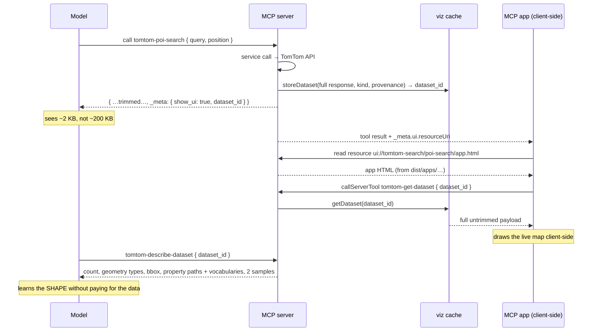
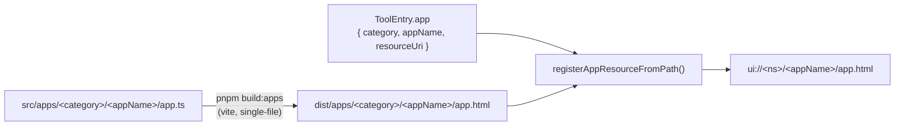
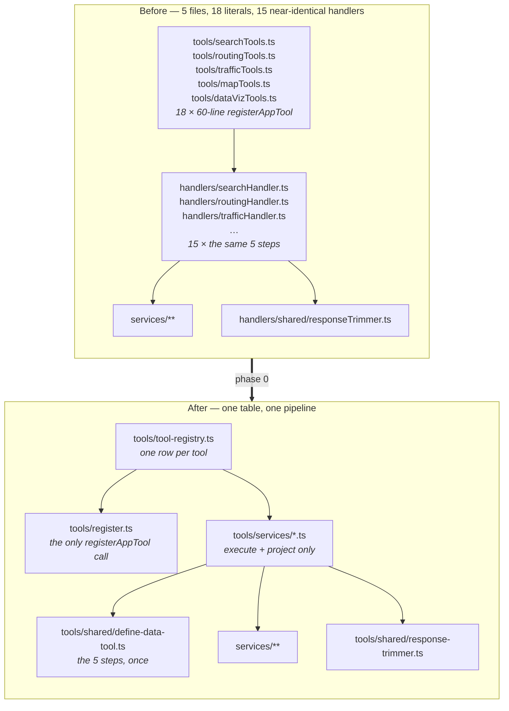
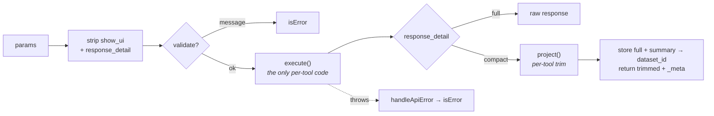

# Tool architecture

How the MCP tool layer is put together, what changed in the phase-0 refactor, and
how tools relate to MCP apps.

- To **add** a tool, follow [`../Adding_new_tools.md`](../Adding_new_tools.md).
- For where the tool surface is **heading**, see
  [`proposals/agent-toolkit-alignment.md`](./proposals/agent-toolkit-alignment.md).

---

## Two audiences, one tool

Every data tool serves two consumers at once, and almost every design decision in
this layer follows from that:

| | The **model** | The **MCP app** |
| --- | --- | --- |
| Wants | The smallest text that answers the question | The full, untrimmed payload to draw |
| Gets | A trimmed projection + a `dataset_id` | The same `dataset_id`, redeemed for the full data |
| Cares about | `description`, `inputSchema` | `_meta.ui.resourceUri`, the stored payload |
| Cost of getting it wrong | Wrong tool picked, or context blown | Nothing to render |

A single tool call therefore produces **two different views of one result**. The
server renders no images: it builds state, stores it, and hands out a key.

Since phase 1 the model gets that key too — `dataset_id` is no longer app-only
plumbing. `tomtom-describe-dataset` reads it, which is what forced the store to
grow owner scoping (a handle the model can pass to a read tool is a guessable read
primitive) and a byte budget.



### The full round trip



Three consequences worth internalising:

1. **`show_ui: false` still stores.** It used to skip the store — the app was the
   only consumer. It no longer is: `describe-dataset` needs the payload whether or
   not anything is drawn.
2. **The TTL is 30 minutes**, up from 5. Five was tuned for "the app fetches
   immediately"; a dataset the model queries across several turns has to outlive a
   pause for thought. `src/apps/shared/decompress.ts` still keeps a `localStorage`
   copy so a conversation reopened after a server restart can draw.
3. **Datasets are owner-scoped.** Keyed by a digest of the resolved API key — never
   the key itself. Another principal's `dataset_id` returns the same "not found" as
   a genuine miss, deliberately, so the store cannot be probed for which ids exist.
4. **There is a byte budget.** `node-cache` bounds only time, so a 50 MB BYOD
   upload used to sit in RSS for its whole TTL. Entries carry an estimated size
   (extrapolated from the summary sample — serialising 50 MB to measure it would
   cost more than the fetch) and the oldest are evicted past 256 MB or 500 entries.
5. **Clients without app support degrade to text.** They still get the trimmed
   projection; they just never redeem the `dataset_id`.

### Why three tools are hidden from the model

`tomtom-get-api-key`, `tomtom-get-app-config` and `tomtom-get-dataset` exist
*only* to serve the apps. They are registered with `visibility: "app"`, which
`register.ts` turns into `_meta.ui.visibility = ["app"]`, and a non-app client
never sees them. `evals/harness/transport.test.ts` asserts that over a real
transport — a leak would put "fetch the raw payload" in the model's toolbox and
undo the entire trimming design.

### Apps are built separately from the server



9 of the 12 model-visible tools declare an app (`describe-dataset` has nothing to
draw), and exactly 15 apps are built — a mismatch means an orphan (9 apps built, 9 referenced).

The registry row is the only link between a tool and its app. `app.category` and
`app.appName` locate the built HTML on disk; `app.resourceUri` is what the tool
advertises and the resource registers under. Get them out of step and the app
resolves to the "App not found — run `npm run build:apps`" placeholder rather than
failing loudly, so `tool-registry.test.ts` asserts the URI is derived from
`appName`.

> **Orphaned apps are silent.** Nothing warns when an app directory has no
> registry row — the build just keeps shipping it. `src/apps/routing/waypoint-routing/`
> was exactly this: `tomtom-waypoint-routing` was merged into `tomtom-routing`
> in `56089fd` (which took an ordered `locations` array covering both A→B and
> multi-stop), and its app was left behind, still built on every run. It has been
> deleted. Watch for this whenever a tool retires — see phase 4 below.

---

## What phase 0 changed

The tool layer used to be four hops with the interesting parts duplicated at each
one. It is now a table plus two shared functions.



Net effect: **−2,824 / +977** lines on tracked files.

| Concern | Before | Now |
| --- | --- | --- |
| Tool metadata (name, description, schema, annotations, app) | 18 inline literals across 5 files | one row in `tool-registry.ts` |
| `registerAppTool` calls | 18 | **1**, in `register.ts` |
| Annotations block | copy-pasted 18× | `READ_ONLY_ANNOTATIONS`, applied once |
| The request pipeline | 15 handler factories | `defineDataTool()` |
| `response_detail === "full"` branch | copy-pasted **12×** | once, in the pipeline |
| `catch` + `handleApiError` + log | 15× | once, in the pipeline |
| Token-saving projections | split across handlers + `responseTrimmer` | all in `tools/shared/response-trimmer.ts` |
| API-key preamble | 9 copies of `getEffectiveApiKey()` + throw | `requireApiKey()` |
| Optional-param plumbing | `if (x !== undefined) params.x = x` ladders | `compact()` / `nonEmpty()` |

### Anatomy of a registry row

```ts
{
  name: "tomtom-poi-search",          // what the model calls
  title: "TomTom POI Search",         // client UI + annotations.title
  description: "Search for a specific business or POI…",   // drives tool selection
  inputSchema: tomtomPOISearchSchema, // Zod raw shape
  handler: poiSearchHandler,          // built by defineDataTool
  kind: "places",                     // what it produces (phase 1 uses this)
  app: app("tomtom-search", "search", "poi-search"),       // its MCP app
  tags: ["search", "discover", "place"],
  examplePrompts: [                   // ← the eval corpus, not decoration
    "Find all Starbucks in Berlin",
    "List Italian restaurants in Amsterdam",
  ],
  relatedTools: ["tomtom-area-search", "tomtom-nearby"],
  dependsOn: ["tomtom-poi-categories"],
}
```

`examplePrompts` is load-bearing: `evals/scenarios/` reads it through
`getDefaultToolPrompts()`, so a prompt added here becomes a tool-selection test on
the next run, and `tool-registry.test.ts` fails if any model-visible tool has
none. `tags` / `relatedTools` / `dependsOn` share their vocabulary with the agent
toolkit's registry so the two surfaces can be compared field by field.

### The `defineDataTool` pipeline



A tool supplies `execute` (params → raw API response) and `project` (raw → what
the model sees). The pipeline owns everything else: transport params, validation,
the `full` escape hatch, the cache write, and error shaping. Most tools are now
6–10 lines:

```ts
export const geocodeHandler = defineDataTool<GeocodeSearchParams, unknown>({
  verb: "Geocoding",
  execute: ({ query, ...options }) => geocodeAddress(query, options),
  project: trimSearchResponse,
});
```

Three tools opt out, for stated reasons: `poiCategoriesHandler` (a small static
lookup — nothing to cache, nothing to trim), `dynamicMapHandler` (returns prose
plus a bare `dataset_id`, and stores `result.mapState` rather than the whole result),
and `dataVizHandler` (no upstream API call, and it already returns a *summary*
rather than data — the thing phase 1 generalises).

### Layout

```
src/
├── apps/                        # MCP app sources — built to dist/apps/
│   ├── <category>/<appName>/    #   search/, routing/, traffic/, map/, data-viz/
│   └── shared/                  #   api-key, decompress (dataset_id → full data), map-controls
├── schemas/                     # Zod raw shapes — the model-facing input contract
├── services/
│   ├── api-key.ts               # key resolution + server identity
│   ├── params.ts                # compact() / nonEmpty()
│   ├── datasets/
│   │   ├── dataset-store.ts     # the dataset_id store (owner-scoped, byte-capped)
│   │   ├── geojson.ts           # shared FeatureCollection normalisation
│   │   └── summarize.ts         # describe data without shipping it
│   ├── search|routing|traffic|map/
│   └── traffic/traffic-rest.ts  # the last axios consumer (one endpoint)
├── tools/
│   ├── tool-registry.ts         # ← THE TABLE. Start here.
│   ├── register.ts              # the only registerAppTool call
│   ├── tool-tags.ts             # tag vocabulary, shared with the agent toolkit
│   ├── app-tools.ts             # the 3 app-only handlers
│   ├── services/                # per-tool execute + project
│   └── shared/
│       ├── tool-entry.ts        # ToolEntry, READ_ONLY_ANNOTATIONS
│       ├── define-data-tool.ts  # the pipeline
│       ├── sandbox/             # LLM code execution — vendored core + jailed
│       │                        #   child-process executor (read its header
│       │                        #   before touching the isolation model)
│       ├── response-trimmer.ts  # every token-saving projection
│       └── resource-registry.ts # app HTML → MCP resource
├── createServer.ts              # builds McpServer, calls registerTools()
├── index.ts / indexHttp.ts      # stdio / HTTP entry points
└── evals/                       # model-in-the-loop tests (see evals/README.md)
```

---

## The tool surface

**12 model-visible tools + 3 app-internal.** All are read-only, idempotent
lookups, so `READ_ONLY_ANNOTATIONS` applies to every one.

| Tool | `kind` | App |
| --- | --- | --- |
| `tomtom-discover-places` | places | ✓ |
| `tomtom-locate-place` | places | ✓ |
| `tomtom-reverse-geocode` | places | ✓ |
| `tomtom-poi-categories` | — | ✓ |
| `tomtom-plan-route` | routes | ✓ |
| `tomtom-find-reachable-areas` | ranges | ✓ |
| `tomtom-get-traffic` | incidents | ✓ |
| `tomtom-dynamic-map` | mapState | ✓ |
| `tomtom-data-viz` | byod | ✓ |
| `tomtom-describe-dataset` | — | — |
| `tomtom-analyse-data` | — | — |
| `tomtom-get-api-key` | — | app-only |
| `tomtom-get-app-config` | — | app-only |
| `tomtom-get-dataset` | — | app-only |

Shared input machinery lives in `src/tools/shared/inputs/`: the `locationInput`
union (three ways to name a place, accepted by every tool that means "a place"),
the `where` resolver (`within` / `nearby` / `global`, resolving area names to
boundary polygons and routes to corridors), and mixed code-or-natural-language
POI category resolution. Those three are what let one tool replace seven — and
they are reused by `plan-route`, `find-reachable-areas` and `get-traffic`, which
is why naming a place or an area now works identically everywhere.

> **One tool, one app.** The MCP UI resource is bound to the tool DEFINITION, not
> the result — so a tool cannot pick its renderer at call time. That is why
> `dynamic-map` and `data-viz` are still separate: merging them means merging two
> substantially different renderers, not just their schemas.

### Where it is heading

Phase 0 changed the *plumbing* and left the surface untouched. Phase 1 changed the
wire format (`viz_id` → `dataset_id`, `tomtom-get-viz-data` → `tomtom-get-dataset`)
and added a tool. **Breaking changes to the tools and the MCP apps are
sanctioned** — see the proposal for the full plan:

| Phase | Tool-surface change |
| --- | --- |
| 1 ✅ | `viz_id` → `dataset_id`; the dataset store; shared `summarize()`; `tomtom-describe-dataset` |
| 2 ◐ | `tomtom-analyse-data` (code execution in a jailed child process); `response_detail` **deleted**; field trimmers kept, with reasons |
| 3 ◐ | `dataset_id` accepted by `data-viz`. `tomtom-process-data` landed and was then removed — the capability benchmark never called it once in 65 task-runs |
| 4 ✅ | 18 tools → 11: search 7→2, routing 3→2, traffic renamed onto `where`. `show-map` not merged — the MCP app is bound to the tool definition, so it is a renderer merge, not a schema one |

Phase 4 stops mirroring the API catalog. Today's surface is one tool per endpoint,
which pushes the *joining* onto the model — "Italian restaurants in Amsterdam" is
three round trips (resolve the category, geocode the city, then search) where two
are pure plumbing. The replacement moves that work inside the tools, via the two
patterns the agent toolkit uses:

- a **`where`** object with `within` / `nearby` / `maxDetour` / `global` modes, whose
  resolver geocodes area names to boundary polygons, buffers routes into corridors,
  and unions the results — collapsing seven search tools into one;
- a **location union** (`{ query, queryAs }` | `{ position }` | `{ dataset_id }`) accepted
  everywhere a tool means "a place", so planning a route between two named places is
  one call instead of geocode-geocode-route.

Full design, hop-count comparison, and what does *not* port to a stateless server:
[proposals/agent-toolkit-alignment.md §4](./proposals/agent-toolkit-alignment.md#4-converge-the-tool-surface-phase-4).

Two things gate it. It **depends on phase 1**: the location union needs
`dataset_id` handles to express "the place I already found". And it needs a new
eval assertion — `evals/scenarios/` currently checks *which* tool was called, and
once one tool absorbs seven, "did it call `discover-places`?" is trivially true and
measures nothing. `expectToolCalledWith` (argument-shape assertions) has to land
first, because the dominant failure mode of a wide tool is a well-chosen tool
called with the search subject in the `where` scope.

Each retired tool also retires an app. Removing a registry row (or just its `app`
field) orphans `src/apps/<category>/<appName>/`, and the build will keep shipping
it with no warning — `waypoint-routing` sat orphaned that way from `56089fd` until
it was noticed while writing this document. Phase 4 retires seven search tools at
once, so delete their app directories in the same commit.

---

## Testing the tool layer

| What | Where | Needs |
| --- | --- | --- |
| Registry invariants (unique names, tags in vocabulary, `relatedTools` resolve, URI derived from `appName`, every tool has prompts) | `src/tools/tool-registry.test.ts` | — |
| Registration (all rows registered once, annotations applied, app resources, visibility) | `src/tools/register.test.ts` | — |
| Real `McpServer` boots and exposes the exact 15-tool surface | `src/createServer.smoke.test.ts` | — |
| Per-tool `execute` / `project` | `src/tools/services/*.test.ts` | — |
| Tools work over the wire, no model | `tests/test-stdio-tools.js`, `tests/test-http-tools.js` | API key |
| Wire surface == registry | `evals/harness/transport.test.ts` | `pnpm build` |
| Does a model pick the right tool? | `evals/scenarios/` | model key |
| Can a model actually answer? | `evals/capability/` | model + API key |
